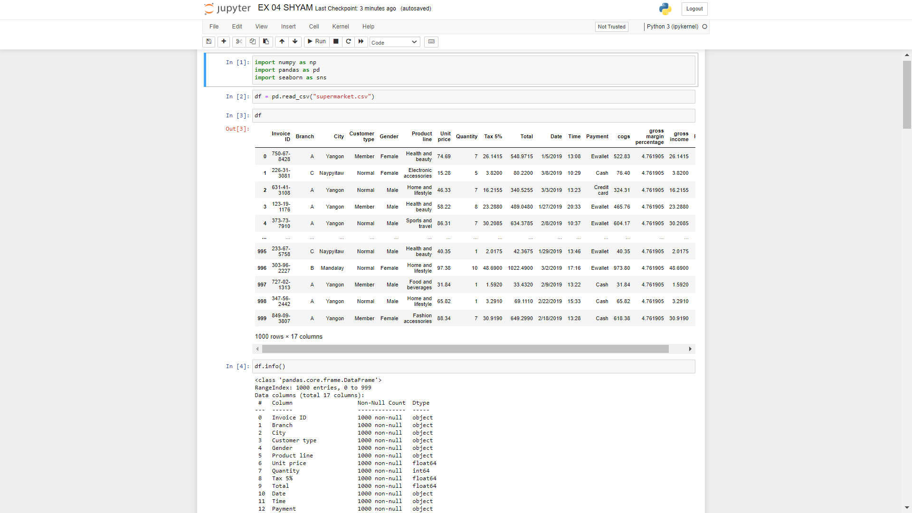
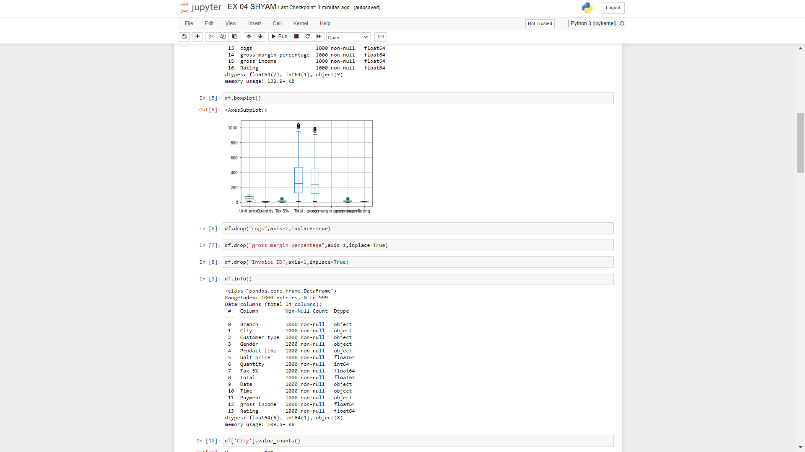
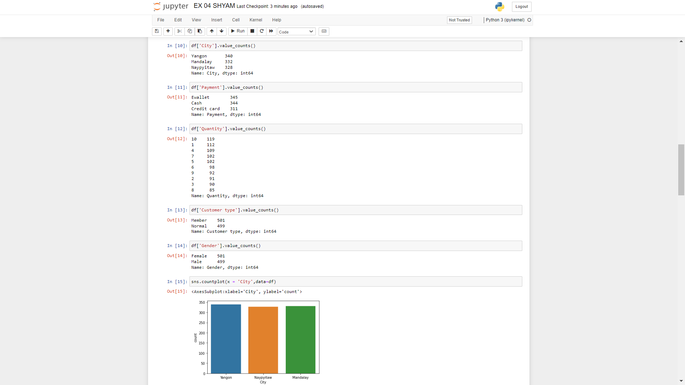
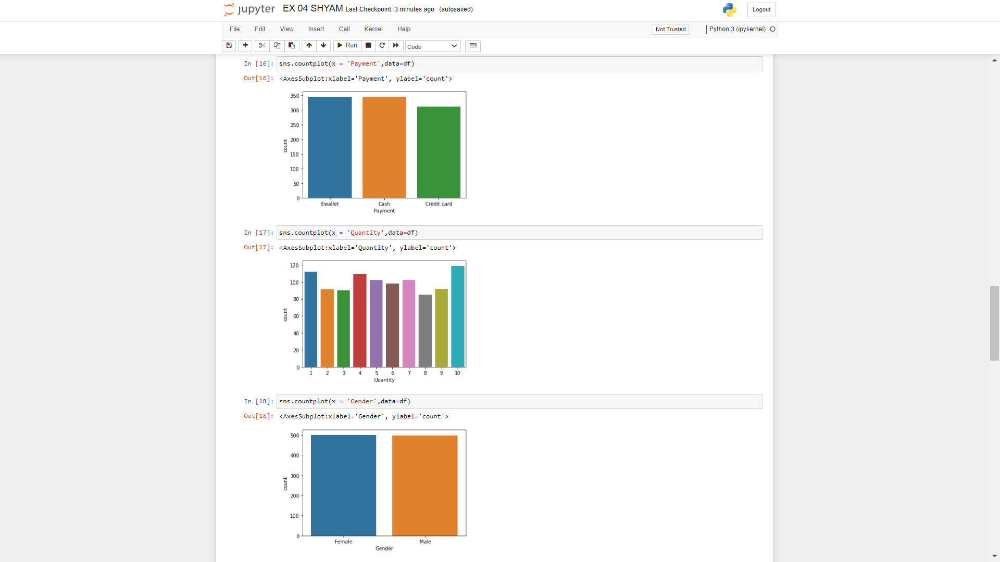
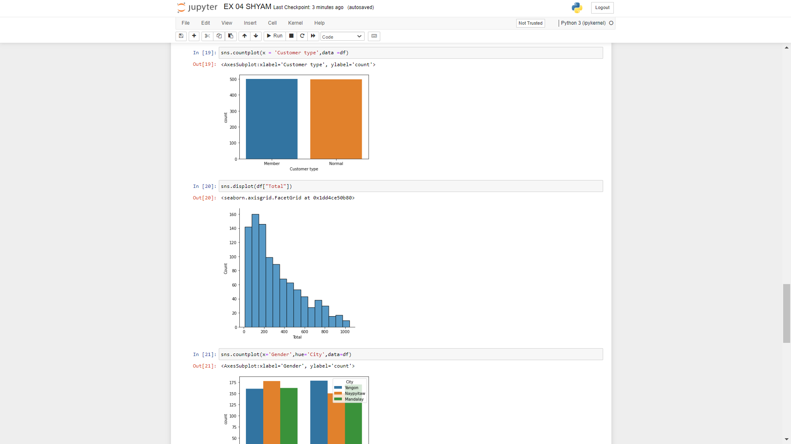
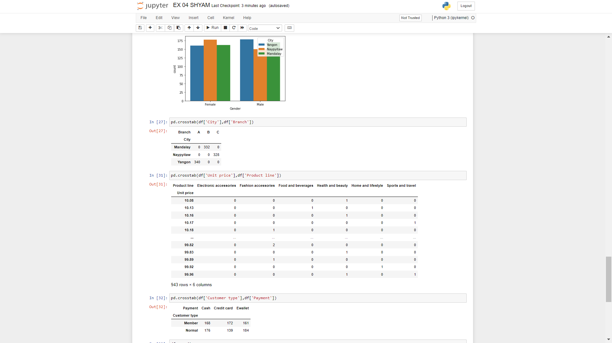
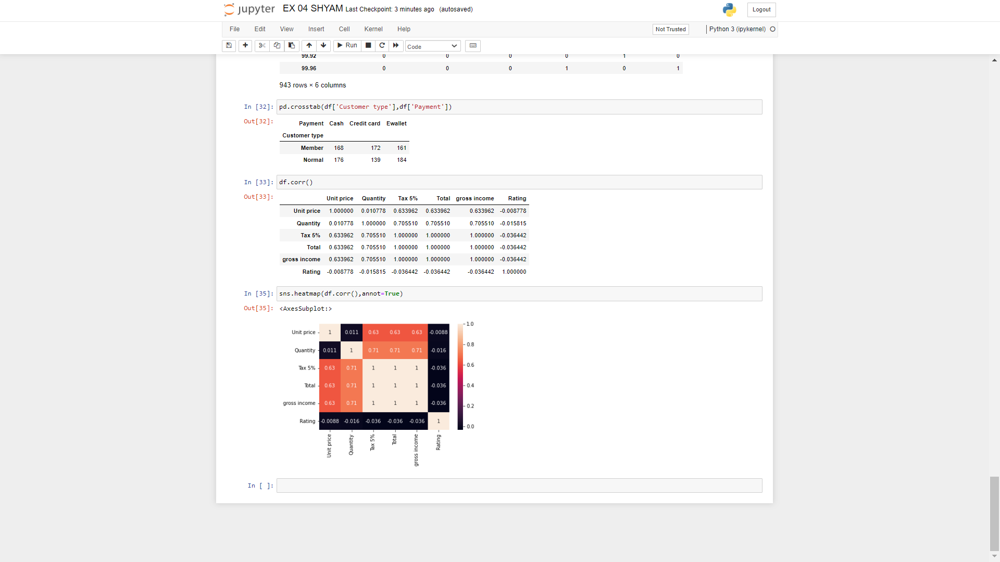

# Ex-04-EDA

## AIM : To perform EDA on the given data set. 

## Explanation : The primary aim with exploratory analysis is to examine the data for distribution, outliers and anomalies to direct specific testing of your hypothesis.
 

# ALGORITHM :

### STEP 1: Create a new file in jupyter notebook.

### STEP 2: Upload the given csv file.

### STEP 3: Write codes for Data Analysis (EDA).

### STEP 4: Plot the result in various formats.

### STEP 5: Co-relation and plot heatmap for thr given dataset.

### STEP 6: End the program.

# CODE:
~~~

import numpy as np
import pandas as pd
import seaborn as sns
df = pd.read_csv("supermarket.csv")
df
df.info()
df.boxplot()
df.drop("cogs",axis=1,inplace=True)
df.drop("gross margin percentage",axis=1,inplace=True)
df.drop("Invoice ID",axis=1,inplace=True)
df.info()
df['City'].value_counts()
df['Payment'].value_counts()
df['Quantity'].value_counts()
df['Customer type'].value_counts()
df['Gender'].value_counts()
sns.countplot(x = 'City',data=df)
sns.countplot(x = 'Payment',data=df)
sns.countplot(x = 'Quantity',data=df)
sns.countplot(x = 'Gender',data=df)
sns.countplot(x = 'Customer type',data =df)
sns.displot(df["Total"])
sns.countplot(x='Gender',hue='City',data=df)
pd.crosstab(df['City'],df['Branch'])
pd.crosstab(df['Unit price'],df['Product line'])
pd.crosstab(df['Customer type'],df['Payment'])
df.corr()
sns.heatmap(df.corr(),annot=True)

~~~

# OUPUT:

